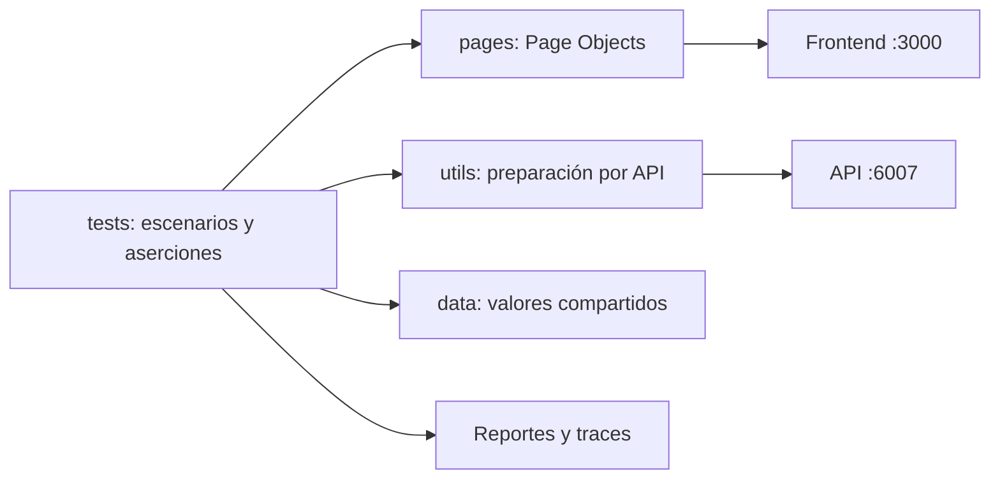
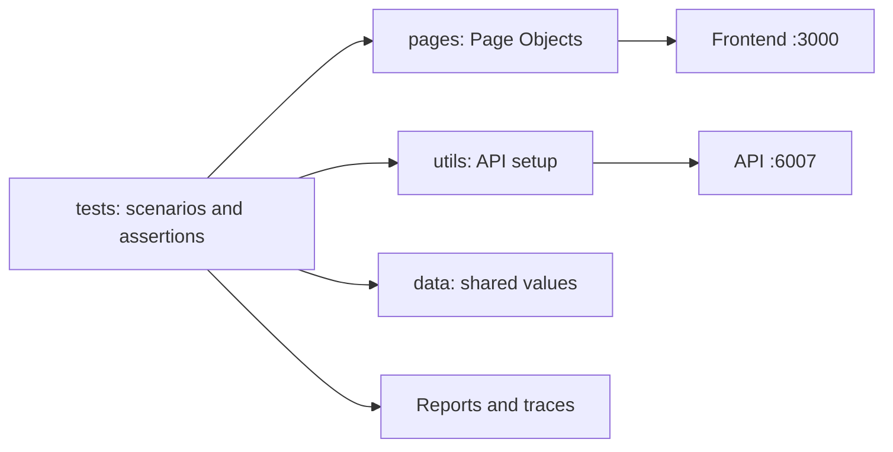

# Playwright E2E | Inicio de sesión y banca

Suite de pruebas end-to-end con **Playwright** y **TypeScript** para validar los
flujos principales de una aplicación financiera desde la perspectiva de sus
usuarios. Combina pruebas de interfaz en navegador con preparación puntual de
datos mediante API para mantener los escenarios legibles y reproducibles.

| Tecnología | Uso en este proyecto |
| --- | --- |
| Playwright Test | Ejecución, aislamiento de contextos, aserciones y reporter HTML |
| TypeScript | Implementación de escenarios, Page Objects y utilidades |
| API de la aplicación | Creación rápida de usuarios para las precondiciones |
| Chromium, Firefox y WebKit | Ejecución de los escenarios en motores de navegador |

## Objetivo y alcance

La suite cubre los siguientes recorridos de usuario:

| Área | Cobertura |
| --- | --- |
| Registro | Campos visibles, validación, registro válido y correo duplicado |
| Inicio de sesión | Acceso al panel con credenciales válidas |
| Manejo de errores | Presentación en la interfaz de una respuesta HTTP 500 |
| Cuentas | Creación de una cuenta de débito durante la preparación |
| Transferencias | Envío de dinero y verificación de la recepción en otra sesión |
| Contrato de API | Estado HTTP y estructura básica de la respuesta de registro |

Los Page Objects encapsulan selectores y acciones de la interfaz; los casos de
prueba expresan el comportamiento esperado. El API se utiliza como apoyo para
preparar usuarios, no como sustituto de las verificaciones de interfaz.

## Arquitectura de un vistazo



### Flujo de una transferencia

1. La preparación registra un emisor único mediante el API.
2. El emisor inicia sesión por la interfaz y crea una cuenta de débito con
   saldo inicial de `1000`.
3. Playwright guarda su sesión local para reutilizarla.
4. El emisor envía `10` al destinatario configurado.
5. La prueba del destinatario espera hasta que el movimiento `+ 10.00` aparezca
   en el panel.

> **Aislamiento:** el emisor se crea de forma única, pero el destinatario usa
> los datos compartidos de `data/testData.json`. Las pruebas de transferencia
> modifican esos datos; ejecútelas contra un entorno de pruebas controlado y
> evite ejecuciones simultáneas contra el mismo backend.

## Requisitos

- Node.js 18 o posterior y npm.
- El frontend activo en `http://localhost:3000`.
- El API activo en `http://localhost:6007`.
- Los navegadores de Playwright instalados.

## Puesta en marcha

```bash
npm ci
npx playwright install
npm test
```

`npm ci` instala las dependencias exactamente según `package-lock.json`.
`npx playwright install` descarga los navegadores de prueba. Antes de ejecutar
los escenarios, inicie el frontend y el API en las direcciones indicadas.

## Comandos de trabajo

| Objetivo | Comando |
| --- | --- |
| Ejecutar la suite | `npm test` |
| Abrir la interfaz de Playwright | `npm run test:ui` |
| Depurar con el inspector | `npm run test:debug` |
| Ejecutar con navegador visible | `npm run test:headed` |
| Ejecutar un archivo | `npm test tests/login.spec.ts` |
| Filtrar por nombre | `npm test -- --grep "TC-07"` |
| Abrir el reporte HTML | `npm run test:report` |
| Generar código de navegador | `npm run codegen` |

## Resultados y datos locales

- El reporter HTML de Playwright se abre con `npm run test:report`.
- En el primer reintento se recopila un trace para diagnosticar fallos.
- `tests/register.setup.ts` genera los estados de sesión en
  `.playwright/.auth/`.
- Los estados de autenticación y los datos de prueba pueden contener
  información sensible del entorno local: no los publiques ni los compartas.

Para instalación detallada, convenciones y diseño, consulte
[SETUP.md](./SETUP.md), [TESTING.md](./TESTING.md),
[ARCHITECTURE.md](./ARCHITECTURE.md) y
[PRESENTATION.md](./PRESENTATION.md).

## Estructura del repositorio

```text
e2e-login-test/
├── data/                  # Datos y generadores de prueba
├── pages/                 # Page Objects y diálogos
├── tests/                 # Escenarios y preparación de sesiones
├── utils/                 # Auxiliares de API/backend
├── playwright.config.ts   # Proyectos, navegadores y reporter
├── package.json           # Scripts y dependencias
├── SETUP.md               # Requisitos e instalación
├── TESTING.md             # Comandos y convenciones de prueba
├── ARCHITECTURE.md        # Capas y flujos principales
└── PRESENTATION.md        # Resumen para presentar el proyecto
```

---

## English

### Playwright E2E | Login and Banking

End-to-end test suite built with **Playwright** and **TypeScript** to verify
the main user journeys of a financial application. It combines browser-based
UI tests with targeted API-based data setup to keep scenarios readable and
repeatable.

| Technology | Role in this project |
| --- | --- |
| Playwright Test | Execution, context isolation, assertions, and HTML reporting |
| TypeScript | Test scenarios, Page Objects, and helpers |
| Application API | Fast user creation for test preconditions |
| Chromium, Firefox, and WebKit | Cross-browser scenario execution |

### Purpose and scope

The suite covers these user journeys:

| Area | Coverage |
| --- | --- |
| Registration | Visible fields, validation, successful signup, and duplicate email |
| Login | Access to the dashboard with valid credentials |
| Error handling | UI presentation of an HTTP 500 response |
| Accounts | Debit account creation during setup |
| Transfers | Sending money and verifying receipt in a second session |
| API contract | HTTP status and basic structure of the signup response |

Page Objects encapsulate UI selectors and actions; test cases describe the
expected behavior. The API is used to prepare users, not to replace UI
verification.

### Architecture at a glance



#### Transfer flow

1. Setup registers a unique sender through the API.
2. The sender logs in through the UI and creates a debit account with an
   initial balance of `1000`.
3. Playwright saves the local session for reuse.
4. The sender transfers `10` to the configured recipient.
5. The recipient test waits until the `+ 10.00` transaction appears on the
   dashboard.

> **Isolation:** the sender is created uniquely, but the recipient uses shared
> data from `data/testData.json`. Transfer tests modify that data; run them
> against a controlled test environment and avoid overlapping runs against the
> same backend.

### Requirements

- Node.js 18 or later and npm.
- The frontend running at `http://localhost:3000`.
- The API running at `http://localhost:6007`.
- Playwright browsers installed.

### Getting started

```bash
npm ci
npx playwright install
npm test
```

`npm ci` installs dependencies exactly as specified in `package-lock.json`.
`npx playwright install` downloads the test browsers. Start the frontend and
API at the listed addresses before running scenarios.

### Common commands

| Goal | Command |
| --- | --- |
| Run the suite | `npm test` |
| Open Playwright UI mode | `npm run test:ui` |
| Debug with the inspector | `npm run test:debug` |
| Run with a visible browser | `npm run test:headed` |
| Run one file | `npm test tests/login.spec.ts` |
| Filter by test name | `npm test -- --grep "TC-07"` |
| Open the HTML report | `npm run test:report` |
| Generate browser code | `npm run codegen` |

### Results and local data

- Open the Playwright HTML reporter with `npm run test:report`.
- A trace is collected on the first retry to help diagnose failures.
- `tests/register.setup.ts` generates session state in `.playwright/.auth/`.
- Authentication state and test data may contain sensitive local environment
  information: do not publish or share them.

For setup, test conventions, and design details, see
[SETUP.md](./SETUP.md), [TESTING.md](./TESTING.md),
[ARCHITECTURE.md](./ARCHITECTURE.md), and
[PRESENTATION.md](./PRESENTATION.md).

### Repository structure

```text
e2e-login-test/
├── data/                  # Test data and generators
├── pages/                 # Page Objects and dialogs
├── tests/                 # Scenarios and session setup
├── utils/                 # API/backend helpers
├── playwright.config.ts   # Projects, browsers, and reporter
├── package.json           # Scripts and dependencies
├── SETUP.md               # Requirements and installation
├── TESTING.md             # Test commands and conventions
├── ARCHITECTURE.md        # Main layers and flows
└── PRESENTATION.md        # Project presentation brief
```
